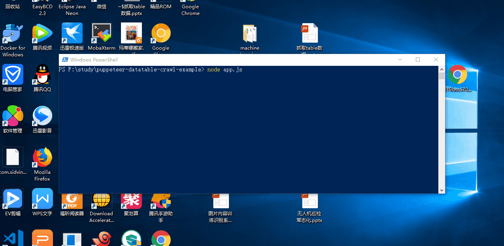

# puppeteer datatable crawl example

you may need to change lots of code to fit your own case



## usage

```
git clone https://github.com/postor/puppeteer-datatable-crawl-example.git
cd puppeteer-datatable-crawl-example

# config your own url/user/pass
vi config.json 

yarn && node app.js
```